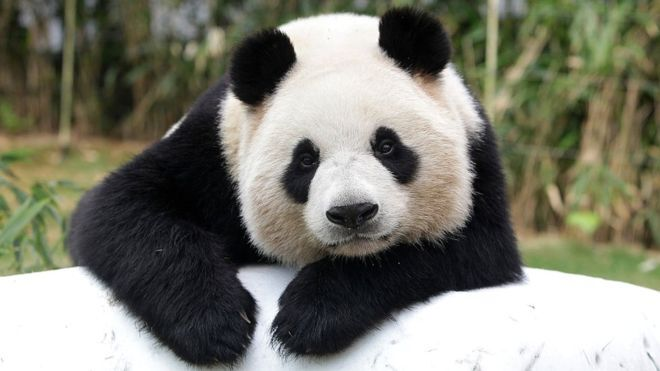
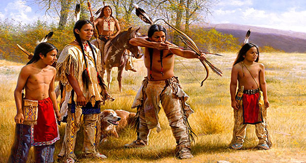
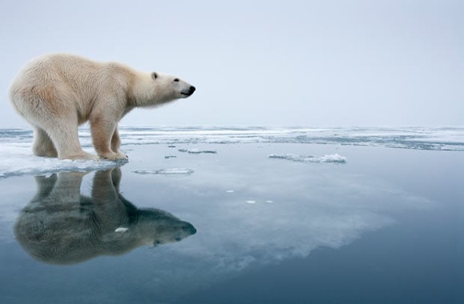
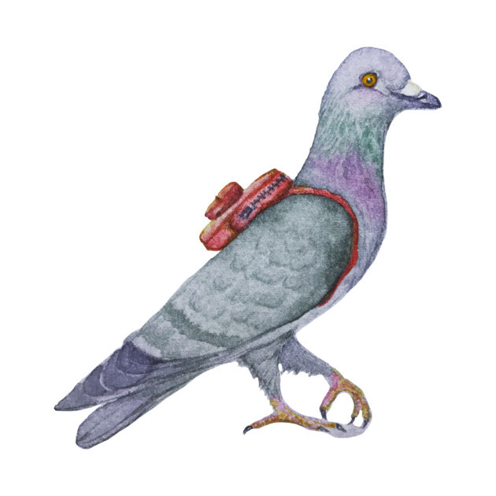

## Unit 1 - All Change

> Reading
---
# fatal

> There was a _fatal_ accident on the freeway.
----
* Climate change could be fatal for humans and lead to the end of our species.
---
# mandatory

> Military service in Greece is _mandatory_.
----
# mandatory

> It is _mandatory_ to wear a seatbelt, so please fasten yours.
---
# respond

> I'm still waiting for George to _respond_.
---
# responsive

> The car's steering system is extremely _responsive_.
---
# habitat

> The panda's natural _habitat_ is the bamboo forest.
----
* Humans have made towns a convenient habitat to live in.
---
# inhabit

> Native Americans, also known as American Indians _inhabited_ this area.
----
* This island is not inhabited by humans.
---
# adaptation

> Have you read the Harry Potter books? They're better than the film _adaptation_!
----
# adaptation
`adapt(v)`

> Adaptation to a changing habitat is the only way to ensure a species's survival.
---
# wisdom

> My grandfather's words are full of _wisdom_. He is very _wise_.
----
# wisdom

> In ancient Greece, Athena was regarded as the goddess of _wisdom_.
----
* Native American wisdom was passed on from generation to generation.
---
# convey

> A good photograph can _convey_ far more than words.
----
# convey

> Men can offer a lady flowers to _convey_ their affection.
----
# convey

> In ancient Egypt, carrier pigeons were used to _convey_ news between cities.
----
# convey

> _Conveyor belts_ are used in supermarkets to _convey_ the products to the teller.
---
# abbreviate

---
# accumulate

---
# shrink

> Oh no! My clothes _have shrunk_.
----
* The market for their products is shrinking.
---
# fashion

> 
---
# adopt

---
# subsequent

*
---
# crucial

*
---
# region

*
---
# flourish

*
---
# heed

*
---
# diverse

*
---
# resemble

*
---
# ensure

*
---
# struggle

*
---
# achieve

*
---
# breakthrough

*
---
# inexorable
`unstoppable`

